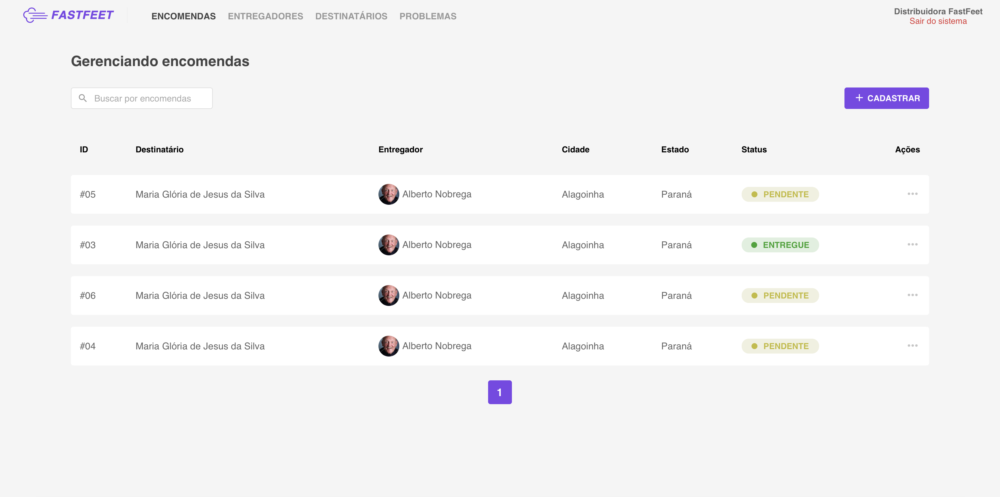
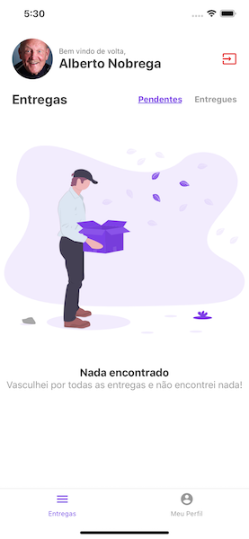

# FastFeet Project

FastFeet Project for **@rocketseat** certification.

## Overview

This repository has tree folders:

- **backend** - A folder for backend project made in NodeJS and Express.
- **frontend** - A folder for web project made in React.
- **mobile** - A folder for mobile project made in React Native.

## Requiriments

- **Yarn** or npm;
- **Postgres** - Relational database
- **Redis** - Non-relational database
- **E-mail** - I use **mailtrap** for development

## How to run (step by step)

- **Clone** this repository;
- **Run the backend**:

  - cd fastfeet/backend && yarn
  - copy the .env.example and make your own .env (configuring Postgres, Redis and Mail)
  - yarn sequelize db:migrate
  - yarn sequelize db:seed:all
  - use yarn dev to run the server
  - use yarn queue to run the queue for e-mail

- **Run the web**:

  - cd fastfeet/web && yarn
  - use yarn start to start de application

- **Run the mobile**:
  - cd fastfeet/mobile && yarn
  - use yarn react-native run-ios or yarn react-native run-android

## Photos

